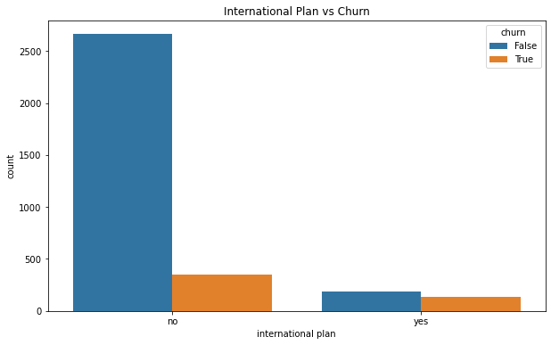
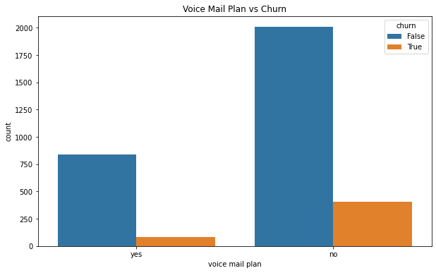

**1.BUSINESS UNDERSTANDING**

The business problem revolves around customer churn, a critical issue for telecom companies like SyriaTel, where retaining existing customers is often more cost-effective than acquiring new ones. 

Predicting churn allows the company to implement proactive retention strategies, improving customer loyalty and profitability.

**Problem Statement:** 

To predict whether a customer will churn(stop doing business) with SyriaTel  based on their account details, usage patterns, and service plans

**Goals and Objectives:** 

Improve customer retention by identifying customers who are at risk customers of churning and taking relevant steps to retain them

**Stakeholders:** SyriaTel Board of Management and Marketing Executives.

**DATA UNDERSTANDING**

The dataset provided for includes  various features we can use to Understand features in the context of customer behavior e.g account length,international plan, voice plan,number of v mail messages, total day minutes, total eve minutes etc.

Data’s properties, has  class imbalance, which should be  carefully handled to ensure accurate model performance and reliable predictions.

**DATA SET CHOICE**

The dataset chosen for this project is a historical record of SyriaTel's customer base, containing features that capture various aspects of customer behavior, service usage, and interaction with the company. 

This dataset is ideal because it includes both behavioral and service-related features that are directly linked to customer satisfaction and retention, making it possible to identify patterns that lead to churn

The dataset also reflects real-world challenges, such as class imbalance, which is common in churn prediction scenarios.

**EXPLORATORY DATA ANALYSIS**
I undertook both Univitrate and Multivitrate Data Analysis and oncvered various insights.

**UNIVARIATE ANALYSIS**

**international plan vs churn**

**1.Higher Churn for customers with  International Plan:**

A large majority of customers do not have an international plan. Among these customers, most have not churned (represented by the blue bar), while a smaller portion has churned (represented by the orange bar).
The orange bar for churn is significantly lower than the blue bar, indicating that churn is relatively low among customers without an international plan.

There is a smaller number of customers who have an international plan compared to those without one.
Interestingly, for customers with an international plan, the orange bar (indicating churn) is almost equal in height to the blue bar (indicating no churn). 

This suggests that customers with an international plan are more likely to churn compared to those without it. Tus Having an International Plan as a Risk Factor:

**Voice mail vs Plan**

!
  
**1. Churn by Voice Mail Plan:**

The majority of customers who have a voice mail plan (represented by the "yes" category) do not churn, as indicated by the significantly taller blue bar (indicating no churn) compared to the orange bar (indicating churn).
The number of churned customers with a voice mail plan is very low, suggesting that having a voice mail plan is associated with lower churn rates.

Among customers who do not have a voice mail plan (represented by the "no" category), the blue bar is still taller than the orange bar, indicating that most of these customers do not churn.

However, the orange bar representing churned customers without a voice mail plan is noticeably higher compared to the churned customers with a voice mail plan. This suggests that customers without a voice mail plan are more likely to churn than those with a voice mail plan.

**2. Potential Protective Factor:**

Having a Voice Mail Plan as a Protective Factor:
The chart suggests that having a voice mail plan might serve as a protective factor against churn. Customers who have this plan are less likely to churn compared to those who do not have it.

**Total day Minutes vs Churn**

!

**1. Comparison of Total Day Minutes Between Churned and Non-Churned Customers:Non-Churned Customers (False):**

The distribution of total day minutes for customers who did not churn (indicated by the blue box) shows that the median total day minutes is around 175 minutes.

The interquartile range (IQR) for non-churned customers is narrower compared to churned customers, indicating that their usage tends to be more consistent and centered around the median.

There are some outliers on the lower end, representing customers with unusually low total day minutes.
Churned Customers (True):

The distribution for customers who churned (indicated by the orange box) shows that the median total day minutes is higher, around 220 minutes.

The IQR for churned customers is wider, indicating greater variability in total day minutes among this group.
There are fewer outliers, but the overall range of total day minutes is higher compared to non-churned customers.

**2. Higher Usage Correlated with Churn:**

The key insight from this plot is that customers who use more total day minutes are more likely to churn. This is evidenced by the higher median and wider spread of total day minutes among churned customers.

This suggests that high usage during the day might be associated with customer dissatisfaction or other factors leading to churn. It could also simply that heavy users may be more sensitive to service issues or pricing changes.

**FEATURE ENGINEERING**

I engineered the below features:

**day cost per minute:**

This feature represents the average cost per minute for daytime calls, calculated by dividing the total day charge by the total day minutes.

**eve cost per minute:**

 This feature indicates the average cost per minute for evening calls, derived by dividing the total evening charge by the total evening minutes.

**intl cost per minute:** 

This feature calculates the average cost per minute for international calls, obtained by dividing the total international charge by the total international minutes.

**customer interaction intensity:**
 This feature measures the frequency of customer service interactions relative to the account length, calculated by dividing the number of customer service calls by the account length.

 **MODELLING**

**MODEL APPROACH**

I decided to use the below 3 models:

**1.Model 1** logistic regression without engineered features

**2.Model 2** logistic regression with engineered features

**3.Model 3** Decison Tree Model

. Logistic regression provided a baseline with interpretable results, while the decision tree model offered more nuanced insights by capturing complex relationships between features.

**MODEL EVALUATION**

I Assessd both model's performance using  Classification report  metrics and ROC and AUC Curves;

**MODEL 1 VS MODEL2 COMPARISON AND ANALYSIS**

The Logistic  Model without Engineered Features outperformed  the model with engineered features and SMOTE in all metrics. It had a higher accuracy and a significantly better ROC-AUC, which suggests it is better at distinguishing between churn and non-churn customers overall. 

However, it still struggled with predicting churn (class 1), as indicated by its lower recall and F1-score for that class.

The Model with Engineered Features and SMOTE, despite efforts to balance the classes using SMOTE, performed poorly overall.

I based the next model(Decsion Tree) on data without engineered features.

**MODEL 1 LOGISTIC REGRESSION VS DECISION TREE MODEL  PERFORMANCE**

Decision Tree: Shows stronger performance in predicting the minority class (churn) with higher recall and a better balance between precision and recall (as seen in the F1-score). The decision tree's higher ROC-AUC also indicates better overall classification ability.

Logistic Regression: Performs better in terms of precision for non-churn cases but significantly underperforms in detecting churners, with a much lower recall and F1-score for class 1.

**Recommendation:**

The decision tree model is more effective for this dataset, particularly in handling the imbalanced nature of the churn problem, providing better recall and overall discriminatory ability

**HYPER PARAMETER TUNING**

I performed  hyperparameter tuning on the Decision Tree  model to improve its performance further.

The hyperparameter tuning process significantly improved the decision tree's performance, particularly in its ability to identify churners (class 1). The model's overall accuracy, ROC-AUC, and F1-scores for both classes have all increased, making it a more effective and reliable model for predicting customer churn.

**RECOMMENDATIONS**

1. Leverage Usage Pattern Insights for Retention: Analyze and monitor key usage patterns such as total day minutes and international plan usage to identify at-risk customers.

2. Enhance Customer Service Experience: Since frequent customer service interactions are linked to higher churn, improve the quality and efficiency of customer support

3. Strategize to Enrol more customer on Voice mail since enroled clients are at a lower risk of churn

 

